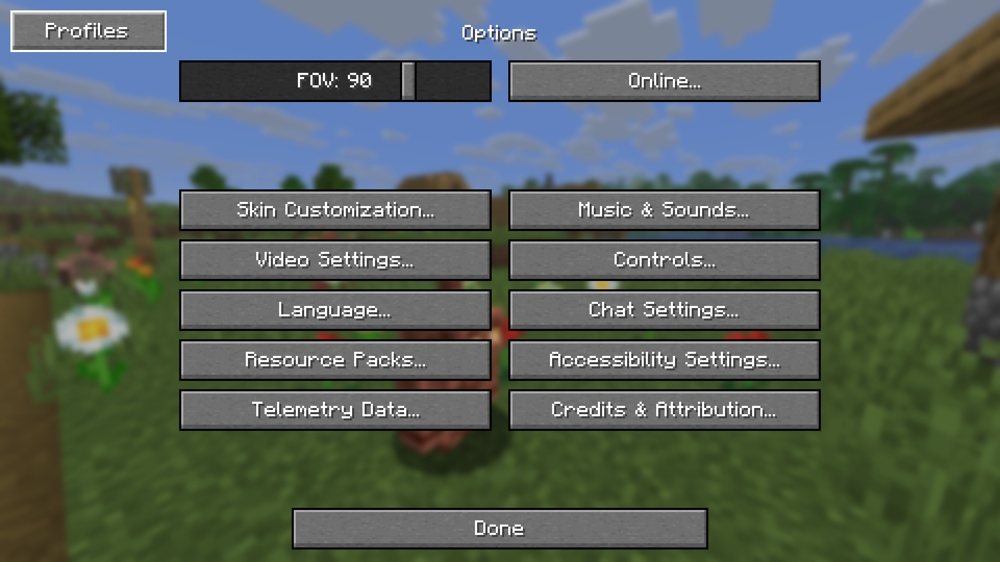
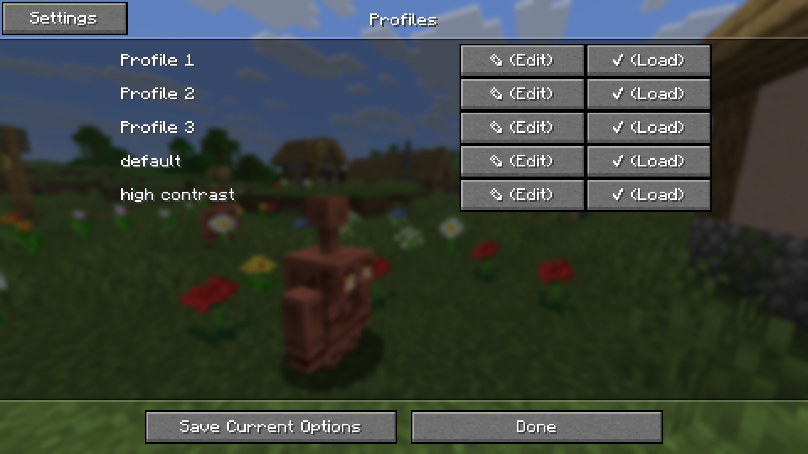
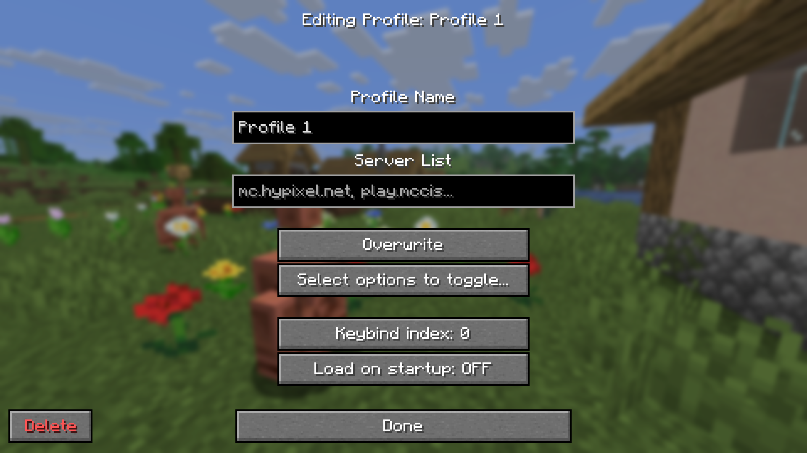
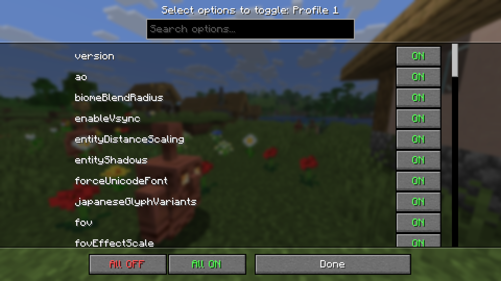

# Options Profiles — Forge 1.8.9

A Forge 1.8.9 port of [Options Profiles](https://github.com/trafficlunar/options-profiles) by trafficlunar.

Ported to Forge 1.8.9 by **Pexifey** — works on Lunar Client and all standard Forge 1.8.9 launchers.

## What it does

Save, load, and manage multiple Minecraft options presets. Switch between PvP settings and high-quality settings instantly without manually editing `options.txt`.

- Save the current `options.txt` (and `optionsof.txt` for OptiFine) as a named profile
- Load any profile with one click or a keybind
- Control which individual options get applied when loading a profile
- Auto-load profiles on game startup
- Auto-load profiles when joining specific servers
- Profiles button injected directly into the vanilla Options screen

## Screenshots






## Installation

Drop the `.jar` into your `mods/` folder. Requires Forge for Minecraft 1.8.9.

Compatible with Lunar Client (Forge mod support), standard Forge launchers, and any 1.8.9 Forge-compatible client.

## Usage

1. Open **Options** in-game — click the **Profiles** button (top-left corner)
2. Click **Save Current** to create a new profile from your current settings
3. Click **Load** on any profile to apply it
4. Click **Edit** to configure per-profile options:
   - **Options Toggle** — choose which specific options get applied on load
   - **Keybind** — assign profile 1/2/3 hotkeys
   - **Load on Startup** — auto-apply when game starts
   - **Servers** — comma-separated IPs to auto-apply on join
5. Use `/optionsprofiles` command to open the Profiles screen from chat

## Keybinds

Three keybind slots (unbound by default). Assign them in Options → Controls → Options Profiles.

## Building from source

Requires JDK 8 and Gradle (wrapper included).

```
gradlew build
```

Output: `build/libs/optionsprofiles-1.8.9-forge-1.4.4.jar`

## Credits

- Original mod: [trafficlunar/options-profiles](https://github.com/trafficlunar/options-profiles)
- 1.8.9 Forge port: **Pexifey**
